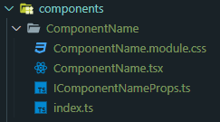

<h1 align="center"> React Typescript Component Generator</h1>

I modified [this package](https://www.npmjs.com/package/react-typescript-component-generator) for my needs.

React Typescript Component Generator is a cli for generating react component for typescript based architucture.

<h2 align="center">
	
</h2>

## Install

```bash
# Global installation
$ npm install --global @disaythis/gen-rtsc
# Local installation
$ npm install --save-dev @disaythis/gen-rtsc
```

## Usage

```bash
$ gen-rtsc <componentName>
```

`<componentName>` is the name of component that can be with or without directory.

- `./src/components/ComponentName`
  this will generate component named _`ComponentName`_ in the directory _`./src/components/ComponentName`_

- `ComponentName`
  this will generate component named _`ComponentName`_ in the directory _`./ComponentName`_

### Generate React Stateless Component

```bash
$ gen-rtsc css <componentName> //  Generate React Stateless Component css
# or
$ gen-rtsc scss <componentName> // Generate React Stateless Component scss
# or
$ gen-rtsc <componentName> // Generate React Stateless Component scss
```
